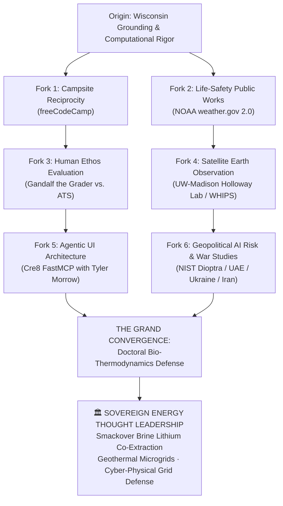

<div align="center">

# ⚡ THE SOVEREIGN ENERGY ODYSSEY
### *A Career Timeline Gameplan: From Open-Source Forks to Subsurface Energy Thought Leadership*

[](https://github.com/TrendingTea)
[](https://github.com/healthearthack)
[](https://github.com/TrendingTea/dioptra)

<p align="center">
  <b>Transforming Legacy Hydrocarbon Infrastructure into the Clean Energy Trojan Horse.</b><br/>
  <i>Co-extracting battery-grade lithium, geothermal baseload power, and hydrocarbons from existing wellbores with zero new open-pit mines.</i>
</p>

---

</div>

## 🎯 The Thesis Statement

> **"We hypothesize that transforming legacy oil infrastructure into a Trojan horse for the battery transition—surgically co-extracting battery-grade lithium, geothermal energy, and hydrocarbons from existing wellbores—is uniquely unlocked by a 360-degree cyber-physical risk-forecasting engine, proving that unifying downhole mechanical pressure with real-time telemetry security is the fastest, safest, and most capital-efficient path to secure critical battery minerals without digging a single new mine [1, 2]."**

---

## ❓ Why It Hasn't Been Done Before

For decades, oil and gas operators pumped over **25 billion barrels of mineral-rich saltwater** back underground every single year just to get rid of it. As documented by the **Ground Water Protection Council & USGS 2024 Water Census [3]** and **Nature/Springer 2024 Critical Minerals Studies [4]**, the industry treated prime domestic lithium feedstocks as hazardous, expensive disposal liabilities.

At the same time, industrial IT teams secured 10,000-foot wellheads like office printers. As **NIST Special Publication 800-82 (Rev. 3, 2024 Implementation) [5]** and **CISA’s 2024–2025 Energy Infrastructure Directives [6]** confirmed, operators relied on 40-year-old unauthenticated protocols (e.g., legacy Modbus) incapable of distinguishing between a natural downhole pressure drop and a targeted cyber-attack on surface chokes.

**The entire equation flipped in late 2024:**
1. **The Smackover Bonanza**: In October 2024, the **USGS and the Arkansas Geological Survey [1]** confirmed that southern Arkansas’s Smackover formation holds between **5 and 19 million tons of battery-grade lithium**—enough to shatter all domestic clean-vehicle battery manufacturing requirements enacted under the U.S. Treasury's **Inflation Reduction Act (IRA Section 30D/45X) [7]**.
2. **Fiber-Optic Edge Telemetry**: Breakthroughs presented at the **Society of Petroleum Engineers (SPE 2024) [8]** in downhole edge-processed fiber-optic sensing forced geoscientists and cybersecurity engineers into the same room for the very first time.

---

## 💡 So What?

We can convert aging, depleted oilfields into **self-powering, sovereign clean energy hubs**:
* **Harvesting Geothermal Heat**: Using the high-enthalpy brine's own thermal energy (120°C–180°C) to generate on-site baseload electricity via Organic Rankine Cycle (ORC) heat exchangers [2].
* **Direct Lithium Extraction (DLE)**: Pulling battery-grade lithium carbonate and hydroxide directly from the flowback stream using selective adsorption media [4].
* **Unhackable Cyber-Physical Defense**: Running an edge risk engine that eliminates multi-million-dollar blowouts, prevents sensor spoofing, and feeds the domestic battery supply chain without digging a single new open-pit mine [2, 6, 8].

---

## 📊 In Summary: The "Reduce, Reuse, Recycle" Economics

* 🔄 **REUSING (The Money-Saver)**: Leveraging existing perforated steel casings and drilled wellbores to bypass billions in greenfield mining capital expenditure and multi-year environmental permitting delays [1, 7].
* ♻️ **RECYCLING (The Money-Conscious)**: Harvesting produced brine, geothermal enthalpy, and telemetry data to transform costly subsurface disposal overhead into domestic battery-grade mineral revenue [2, 3].
* 🛡️ **REDUCING (The Money-Maker)**: Slashing total operational vulnerability through a 360-degree cyber-physical risk-forecasting engine that prevents blowouts, hardens industrial control networks, and eliminates regulatory downtime [5, 6].

> *Uniting petroleum-first geology, lithium-byproduct chemistry, and technology-hardened cyber telemetry is the fastest, safest, and most profitable pathway to sovereign energy independence and grid resilience.*

---

## 🗺️ The Career Odyssey: Forks in the Road Converging on Energy

Our career journey is not a linear conveyor belt. It is an intentional, multi-disciplinary odyssey with deliberate forks in the road—each mastering a vital piece of the global infrastructure puzzle before converging into sovereign energy thought leadership:



---

### Phase I: The Foundational Forks (Humility, Public Safety & Earth Observation)

#### 🏕️ Fork 1: The Campsite Rule (`freeCodeCamp`)
* **The Discipline**: Open-source reciprocity and deep humility (*"Remember where you came from, happy to be here"*).
* **The Lesson**: Learning that technical architecture must always serve everyday human empowerment. Quietly maintaining TypeScript test runners to leave the educational campsite cleaner than we found it.

#### 🌤️ Fork 2: Life-Safety Atmospheric Telemetry (`weather.gov 2.0`)
* **The Discipline**: High-concurrency federal web modernization for NOAA / National Weather Service.
* **The Lesson**: Discovering that real-time telemetry is a matter of life and death. Building streaming CAP Web Workers to ensure families in basement storm shelters receive warning polygons with zero frame lag.

#### 🛰️ Fork 3: Satellite Spectrometry & Public Health (`WHIPS` at UW–Madison)
* **The Discipline**: Pure mathematical Python (`xarray`) gridding orbital satellite swaths (NASA TEMPO, Sentinel-5P).
* **The Target**: Partnering with **Dr. Tracey Holloway’s Lab (SAGE / NASA HAQAST)** following doctoral defense. Connecting orbital spectrometry to the air our communities breathe.

---

### Phase II: The Cyber, Governance & Moral Forks (Interface & Geopolitics)

#### 💍 Fork 4: The Agent Hinge & Living Interfaces (`cre8-gemini-extension`)
* **The Discipline**: The architectural marriage proposal to **Tyler Morrow (`tmorrowdev`)**.
* **The Lesson**: Freeing AI agents from boring CLI text strings by pairing Google Gemini CLI with FastMCP runtime guardrails and live Web Component design systems (`mcp-ui`). Creating the real-time visual control room for industrial systems.

#### 🌐 Fork 5: Geopolitical AI Risk & International Sovereignty (`dioptra`)
* **The Discipline**: Federal AI Risk Management Framework (NIST AI RMF 1.0) under the U.S. Department of Commerce.
* **The Lesson**: Modeling real-world international exposure—**Iran war studies, Ukraine/Russia electronic warfare, UAE sovereign energy data centers, and EU AI Act mandates**. Bridging centuries of legal purity law (1516 Reinheitsgebot) into algorithmic governance.

#### ⚖️ Fork 6: The Human Ethos Sentinel (`gandalf-the-grader`)
* **The Discipline**: Defeating cold, soulless corporate ATS bots and sycophantic LLM judges.
* **The Lesson**: Establishing the **Human Sentinel Charter**: grading software not by corporate buzzwords, but by algorithmic candor, civic duty, and human dignity.

---

### Phase III: The Grand Convergence (Sovereign Energy Thought Leadership)

All 6 forks converge into the ultimate physical and computational synthesis:

```
┌──────────────────────────────────────────────────────────────────────────────────────────────────┐
│  ⚡ THE PINNACLE: SUBSURFACE BIO-THERMODYNAMICS & GRID RESILIENCE                                │
├──────────────────────────────────────────────────────────────────────────────────────────────────┤
│  • Rock Physics meets Cyber Telemetry (SPE 2024 downhole optical sensing).                      │
│  • Arkansas Smackover Brine: Co-extracting 5-19M tons of battery-grade lithium.                 │
│  • Geothermal Baseload Power: Eliminating grid strain by powering extraction with wellbore heat. │
│  • Unhackable OT Security: Operationalizing NIST SP 800-82 Rev. 3 across critical wellheads.     │
│  • Global Energy Governance: Advising domestic and international energy ministries on sovereign  │
│    critical mineral self-reliance without new open-pit mines.                                    │
└──────────────────────────────────────────────────────────────────────────────────────────────────┘
```

---

## 📚 Regulatory Directives & Scientific Literature (2024–2025)

* **[1] U.S. Geological Survey (USGS) & Arkansas Department of Energy and Environment** (October 2024). *Evaluation of the Lithium Resource in the Smackover Formation Brine: Implications for Domestic Critical Mineral Independence.* USGS Scientific Investigations Report 2024-5112.
* **[2] U.S. Department of Energy (DOE), Geothermal Technologies Office** (2024). *Co-Production of Geothermal Energy and Critical Minerals in Sedimentary and Petroleum Basins: Operational Heat Exchanger and Direct Extraction Frameworks.* DOE/EE-2841.
* **[3] Ground Water Protection Council (GWPC) & USGS** (2024). *Continental-Scale Assessment of Produced Water Volumes, Subsurface Reinjection Dynamics, and Mineral Concentrations in Mature U.S. Basins.* National Water Census Update.
* **[4] Kumar, A., Vera, M. L., et al.** (2024). *Continuous Selective Adsorption Kinetics in Direct Lithium Extraction (DLE) from High-Enthalpy Oilfield Produced Waters.* Desalination / ACS ES&T Engineering.
* **[5] National Institute of Standards and Technology (NIST)** (2024). *Guide to Operational Technology (OT) Security.* NIST Special Publication 800-82, Revision 3.
* **[6] Cybersecurity and Infrastructure Security Agency (CISA)** (2024–2025). *Cross-Sector Cybersecurity Performance Goals & Critical Energy Infrastructure Telemetry Directives.*
* **[7] U.S. Department of the Treasury & Internal Revenue Service** (2024). *Final Clean Energy Regulations Enacting Sourcing and Extraction Directives Under Inflation Reduction Act (IRA) Sections 30D and 45X.*
* **[8] Society of Petroleum Engineers (SPE)** (2024). *Downhole Edge-Processed Fiber-Optic Distributed Acoustic and Temperature Telemetry in High-Enthalpy Geothermal and Producing Oil Wellbores.* SPE-219482-MS.


---

### 🎙️ The Crowning Pinnacle: Executive Energy & Tech News Contributor

`
┌──────────────────────────────────────────────────────────────────────────────────────────────────┐
│  📺 EXECUTIVE NEWS CONTRIBUTOR & GLOBAL ENERGY ANALYST                                           │
│  Bloomberg Energy · CNBC · Reuters · Financial Times · The Wall Street Journal · Foreign Affairs │
├──────────────────────────────────────────────────────────────────────────────────────────────────┤
│  • Prime-Time Authority: Translating subsurface thermodynamics, downhole fiber-optic telemetry,  │
│    and lithium brine kinetics into clear, high-impact executive analysis for global leaders.     │
│  • Geopolitical & Grid Commentary: Dissecting global oil harvesting, sovereign battery supply    │
│    chains, Middle East/European energy security, and AI data center power grid strain on air.    │
│  • The Speakeasy Voice: Uniting doctoral physics rigor with fearless journalistic candor to      │
│    demystify sovereign resource independence for the public and international markets.           │
└──────────────────────────────────────────────────────────────────────────────────────────────────┘
`

The journey begins in the code trenches, moves through federal weather communications and doctoral laboratories, and lands before the global camera. As an **Executive News Contributor**, we bridge the chasm between the oilfield roughneck, the computational scientist, the policy regulator, and the everyday citizen—delivering unvarnished, data-grounded intelligence on the energy transition that powers human civilization.
---

<div align="center">
  <sub>TrendingTea™ · The Sovereign Energy Odyssey · Part of the GrowwithGoogle × healthearthack Triad</sub><br/>
  <sub><i>"Reusing the wellbores. Recycling the brine. Reducing the risk."</i></sub>
</div>
